<h1 align="center"> Naftaly Souza </h1>
    

  <b> Backend developer | Linux enthusiast | Systems explorer </b>
   
   
  
  <blockquote>
      
<i>
          "Every line of code is like a clue in a treasure hunt game, taking us closer to the desired solution."
      </i>

  </blockquote>

<!-- Socials -->

  

---

<!-- Language Stats -->

     

<!-- Breve Descricao -->

I am a developer focused on back-end and driven by curiosity. My interest in software grew from the habit of taking something that was already broken and finding a way to make it work again.  
From that, the habit of experimenting and creating solutions came naturally, always making sure to understand the “why,” not just the “how.”.
 
 
I am mostly self-taught and spend a large part of my time learning on my own and exploring the Linux world. 
 

    I see technology as a tool, not a limitation. I adapt to whatever is necessary with a focus on creating functional, efficient solutions. 

    

---

    
    
    
    
    
     
    
    
    
    

 <!-- Views -->

  

<!--

-->
